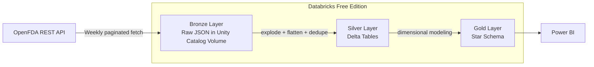

# Pharmacovigilance Data Pipeline

An end-to-end data engineering pipeline that ingests real-world drug adverse event data from the **OpenFDA public API**, processes it through a **Medallion Architecture** (Bronze → Silver → Gold), and models it into a **Star Schema** ready for BI consumption in Power BI.

Built on **Databricks Free Edition** (serverless, Unity Catalog, Delta Lake) with **Git-based CI/CD** via GitHub Actions and Databricks Asset Bundles.

---

## Table of Contents

- [Overview](#overview)
- [Architecture](#architecture)
- [Data Source](#data-source)
- [Pipeline Layers](#pipeline-layers)
  - [Bronze — Raw Ingestion](#bronze--raw-ingestion)
  - [Silver — Cleaned & Flattened](#silver--cleaned--flattened)
  - [Gold — Star Schema](#gold--star-schema)
- [Key Engineering Decisions](#key-engineering-decisions)
- [Tech Stack](#tech-stack)
- [Repository Structure](#repository-structure)
- [CI/CD](#cicd)
- [Setup & Running Locally](#setup--running-locally)
- [Roadmap](#roadmap)

---

## Overview

Pharmacovigilance is the science of monitoring the effects of medical drugs after they've been licensed for use, especially to identify and evaluate previously unreported adverse reactions. This project builds a production-style data pipeline around the **FDA Adverse Event Reporting System (FAERS)**, exposed publicly via the [OpenFDA API](https://open.fda.gov/apis/), to answer questions like:

- Which drugs are most frequently associated with serious adverse events?
- How do reaction patterns vary by patient demographic (age, sex)?
- Which manufacturers have the highest volume of reported events?

The project intentionally mirrors real-world data engineering practices — idempotent ingestion, incremental loading, surrogate-key dimensional modeling, and a proper Git branching/PR workflow — rather than a one-off notebook script.

---

## Architecture



| Layer | Storage | Format | Purpose |
|---|---|---|---|
| **Bronze** | Unity Catalog Volume | Raw JSON | Immutable, untouched copy of API responses |
| **Silver** | Managed Delta Tables | Flattened, typed, deduplicated | Query-able, analysis-ready records |
| **Gold** | Managed Delta Tables | Star Schema (facts + dimensions) | BI-optimized, ready for Power BI |

> **Note:** This project originally ran on Azure Databricks + ADLS Gen2. It was later migrated to **Databricks Free Edition** — a fully managed, cloud-agnostic, permanently free platform — to eliminate cloud infrastructure costs while preserving the exact same Spark/Delta Lake logic. Only the storage layer (Azure Blob → Unity Catalog Volumes) changed; the transformation logic is untouched, demonstrating clean separation between business logic and infrastructure.

---

## Data Source

**[OpenFDA Drug Adverse Event API](https://open.fda.gov/apis/drug/event/)** — a free, public REST API maintained by the U.S. FDA, containing millions of structured adverse event reports submitted by manufacturers, healthcare professionals, and consumers.

Each report includes nested data on:
- The patient (age, sex, weight)
- One or more **drugs** involved
- One or more **reactions** experienced
- Seriousness/outcome classifications

---

## Pipeline Layers

### Bronze — Raw Ingestion

**Notebook:** `notebooks/01_Bronze_Level_Ingestion.py`

- Pulls data in **weekly chunks** to stay under OpenFDA's 25,000 record (`skip + limit`) pagination ceiling
- **Paginates** within each week (1,000 records per request) until all available records are retrieved
- Writes each page as a raw JSON file to a Unity Catalog Volume, partitioned by year/month
- **Idempotent by design:** a week already ingested is skipped entirely on re-run — no wasted API calls
- **Smart re-fetch tracking:** a small checkpoint file records the `end_date` used on the last successful run. The most recent week is only re-fetched when `end_date` has actually been extended since the last run — avoiding both stale data *and* redundant API calls on identical re-runs
- Retries transient failures (network blips, 5xx errors) up to 3 times before failing
- Flags any week that hits the pagination ceiling, so it can be re-pulled in smaller (daily) chunks later

### Silver — Cleaned & Flattened

**Notebook:** `notebooks/02_Silver_Level_Flattening.py`

Transforms nested, semi-structured JSON into three clean, relational Delta tables:

| Table | Grain | Description |
|---|---|---|
| `silver.events` | One row per adverse event report | Patient demographics, dates, seriousness flags |
| `silver.event_drug` | One row per (event, drug) pair | Drug name, dosage, manufacturer, route |
| `silver.event_reaction` | One row per (event, reaction) pair | Reaction term (MedDRA), outcome |

**Key techniques:**
- `explode()` twice — once to flatten one event per report, once each for the nested `drug[]` and `reaction[]` arrays
- `try_to_date()` instead of `to_date()` to gracefully handle OpenFDA's partial/malformed date strings
- Text normalization (`trim`, `upper`) on reaction terms to prevent near-duplicate values
- **Incremental loading:** a `silver.load_log` control table tracks which Bronze files have already been processed. Each run reads only new files, using `append` writes instead of a full rebuild
- **Cross-run deduplication:** a `left_anti` join against the existing table prevents the same `safety_report_id` from being inserted twice across incremental runs — not just within a single batch

### Gold — Star Schema

**Notebook:** `notebooks/03_Gold_Layer_Star_Schema.py`

Builds a BI-ready dimensional model:

- **Fact table:** `fact_adverse_event` — one row per adverse event report
- **Dimensions:** `dim_date`, `dim_patient`, `dim_drug`, `dim_manufacturer`, `dim_reaction`
- **Bridge tables:** `bridge_event_drug`, `bridge_event_reaction` — resolve the many-to-many relationship between events and drugs/reactions

Surrogate integer keys (generated via `row_number()` over deterministic sort order) replace long text fields in the fact and bridge tables, keeping storage lean and joins fast — standard star-schema practice for BI tools like Power BI.

---

## Key Engineering Decisions

- **Medallion architecture over a single flat table** — Bronze preserves raw data as a permanent source of truth, so any bug in downstream transformation logic can be fixed and reprocessed without re-hitting the source API.
- **Star schema over a denormalized flat table** — avoids massive data duplication, keeps dimension updates cheap (one row instead of millions), and is the access pattern BI tools are optimized for.
- **Idempotent, incremental pipelines throughout** — every layer is safe to re-run. Nothing is reprocessed unless there's genuinely new data, which keeps the pipeline cheap and fast as data volume grows.
- **Serverless-only compute** — all notebooks avoid `.cache()`/`.persist()` and `spark.conf.set()`, which aren't supported on Databricks Serverless, in favor of patterns that work identically on serverless or classic clusters.
- **Secrets never hardcoded** — the OpenFDA API key lives in a Databricks Secret Scope, not in notebook source (Git history was scrubbed after an early mistake, using `git filter-repo`).
- **Deploy-only CI/CD** — GitHub Actions deploys the Job definition on every push to `main`, but never auto-triggers a run. Actual pipeline runs stay a deliberate, manual (or scheduled) action.

---

## Tech Stack

| Category | Tool |
|---|---|
| Compute & Storage | Databricks Free Edition (Serverless), Unity Catalog, Delta Lake |
| Processing | PySpark, SQL |
| Orchestration | Databricks Jobs (multi-task, dependency-chained) |
| Infrastructure as Code | Databricks Asset Bundles (`databricks.yml`) |
| CI/CD | GitHub Actions |
| Version Control | Git, GitHub (feature branches + PR review workflow) |
| BI / Consumption | Power BI (via Databricks SQL Warehouse connector) |
| Data Source | OpenFDA REST API |

---

## Repository Structure

```
pharmacovigilance-pipeline/
├── .github/
│   └── workflows/
│       └── deploy-databricks-job.yml   # CI/CD: deploys the bundle on push to main
├── notebooks/
│   ├── 01_Bronze_Level_Ingestion.py
│   ├── 02_Silver_Level_Flattening.py
│   └── 03_Gold_Layer_Star_Schema.py
├── databricks.yml                       # Asset Bundle definition (Job as code)
├── .gitignore
└── README.md
```

---

## CI/CD

Every push to `main` triggers a GitHub Actions workflow that runs:

```bash
databricks bundle deploy -t dev
```

This syncs the notebooks and Job definition to the Databricks workspace, keeping the deployed pipeline in lockstep with the repository — no manual clicking through the Databricks UI required. Actual job **runs** are triggered manually or on a schedule, kept deliberately separate from deployment.

---

## Setup & Running Locally

1. Clone the repo and open it in VS Code with the [Databricks extension](https://marketplace.visualstudio.com/items?itemName=databricks.databricks) installed
2. Sign in via `databricks auth login --host <your-workspace-url>`
3. Create a Secret Scope and add your OpenFDA API key:
   ```bash
   databricks secrets create-scope pharmacovigilance
   databricks secrets put-secret pharmacovigilance openfda_api_key
   ```
4. Create the catalog, schemas (`bronze`, `silver`, `gold`), and a Volume (`raw_adverse_events`) in Unity Catalog
5. Deploy: `databricks bundle deploy -t dev`
6. Run `01_Bronze_Level_Ingestion` → `02_Silver_Level_Flattening` → `03_Gold_Layer_Star_Schema` in order (or trigger the chained Job)

---

## Roadmap

- [ ] Incremental (surrogate-key-stable) loading for the Gold layer, replacing full rebuilds
- [ ] Dynamic `dim_date` range instead of a hardcoded window
- [ ] `Fact_Drug_Recall` table from the OpenFDA drug enforcement/recall endpoint
- [ ] Power BI dashboard published alongside the pipeline
- [ ] Scheduled daily runs via Databricks Jobs cron

---

## Author

**Shubham Saha** — Power BI Developer transitioning into Data Engineering.
